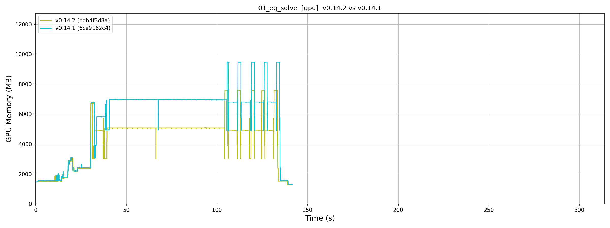
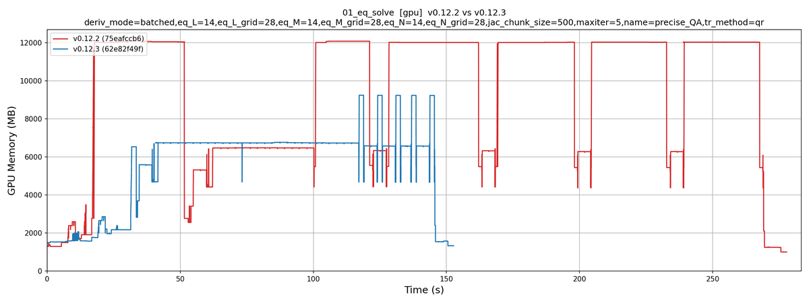

# Benchmarks

Timing and memory benchmarks for DESC, run across branches or commits.

## Running

Edit `bench-config.sh` (branches, envs, device, script, N_REPEAT), then:

```bash
./run-benchmark.sh        # time it
./run-memory-profile.sh   # profile its memory, N_REPEAT forced to 1
```

Both check out each branch in turn, run `scripts/$SCRIPT` on it, and print a
comparison at the end.

For everything at once — every script in `scripts/`, both devices, both modes —
use the standalone sweep, which ignores `bench-config.sh`:

```bash
./run-all.sh                        # commits set inside the script
./run-all.sh master my/branch       # these instead
```

It logs each run separately, skips over failures, and writes a markdown summary.

## Results

One folder per branch, one file per script, device and mode:

```
results/<branch>/<script>_<device>_<speed|memory>.json      timings + settings
results/<branch>/<script>_<device>_memory_<id>.npz          memory trace
```

Runs are keyed by the script's settings, so a different resolution or chunk size
is kept alongside; the same settings overwrite. `<id>` is a short hash of that
same key, so each setting keeps its own trace, and the memory plot gets one
subplot per setting. Read them back with:

```bash
python compare-results.py master my/branch --device gpu             # table
python compare-results.py master my/branch --device gpu --markdown
python compare-results.py master my/branch --mode memory            # plot
```

To step through many versions instead of comparing two, list them at the top of
`compare-versions.py` and run it. It writes one memory figure per consecutive
pair, `memory-<script>-<device>-<v1>-<v2>.png`:



Each version keeps its color and every frame shares its axes, so the frames also
go straight into a gif, `memory-<script>-<device>.gif`:



## Adding a benchmark

Copy any file in `scripts/`, keep its header and its timing block, and put the
work in `run()`. The `CONFIG` dict is what results are keyed by, so it should
list every setting worth varying.

Anything that differs between the branches being compared, but is only setup,
belongs in `scripts/universal.py` — that way every branch builds the same
problem. `run-all.sh` skips it and `__init__.py`.
